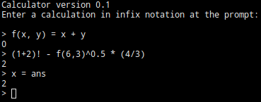

Calculator
==========

Install instructions
--------------------

Navigate to the main directory and run `make`.

Usage
-----

Simply enter expressions to be evaluated as normal. Functions can be defined like so:

`f(x) = x+2`

Supported operators include +, -, *, /, ! (factorial), ^ (exponential).

Documentation
-------------

To generate documentation, navigate to the main directory and run `doxygen doxyfile`.

